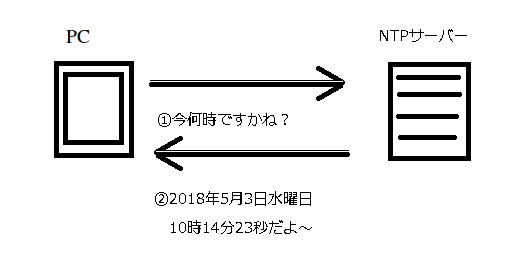
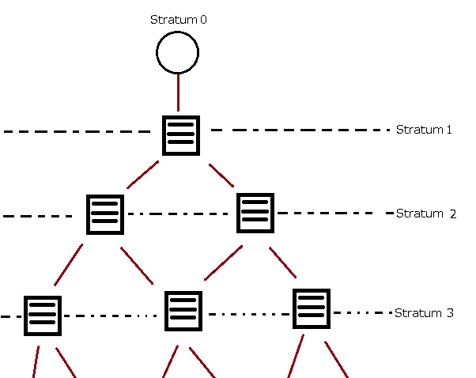

# パソコンの時刻がいつも正確なのはネットに繋がっているから

## まえがき
日々パソコンを触っているが、時刻設定した記憶がないのにかなり正確に近い時刻になっているのはなぜだろうか、と疑問を持った人もいるのではないでしょうか。

それはNTPサーバーと呼ばれる正確な時刻を刻んでいるコンピューターがネットワーク上に存在し、パソコンがNTPサーバーに問い合わせを行うことで正確な時刻を受け取り、その時刻にパソコンが設定を行っているからです。

今回はそのNTPサーバーとはなにかということを簡単にお話したいと思います。

## NTPサーバーとはなんなのか
一般的にサーバーとは機器の役割のことをあわらします。NTPサーバーとはNetwork Time Protcolサーバーの略です。役割としては時刻の問い合わせを受けてけており、問い合わせ(Request)を受けるとそのNTPサーバーが知っている現在時刻を返信(Response)します。

パソコンは設定されたNTPサーバーに定期的に問い合わせを行い、NTPサーバーから受け取った返信をもとに時刻設定を行います。

その定期的間隔はWindows10の初期設定だと１週間となっています。

## なぜNTPサーバーは正確な時刻を知っているか
NTPサーバーは時刻の問い合わせを受け付けるとその正確な時刻を返信しますが、では、なぜNTPサーバーは正確な時刻を知っているでしょうか。

それはNTPサーバーがより上位のNTPサーバーに定期的に問い合わせを行っているからです。

NTPサーバーはstratumという階層構造となっており、皆さんのパソコンが問い合わせているのは末端に当たるものとなるのです。

NTPサーバーには今自分がどの階層にいるかを「stratum（数字）」と表しており、最上位のものが0で、最下層が15まで存在できます。16以降は設定できないようです。

時刻の源泉たるstratum0は世界に複数存在するようですが、その正体はGPS時計あるいは原子時計というものを装備しています。

stratum0はその時刻のデータを下流に流すことで世界中のコンピューターが正確な時刻を刻んでいるのです。

## 参考URL
https://www.billionwallet.com/windows10/timeinterval.html

https://ja.wikipedia.org/wiki/Network_Time_Protocol

https://www.idcf.jp/words/ntp.html

https://kuzunoha-ne.hateblo.jp/entry/2018/05/07/113500
